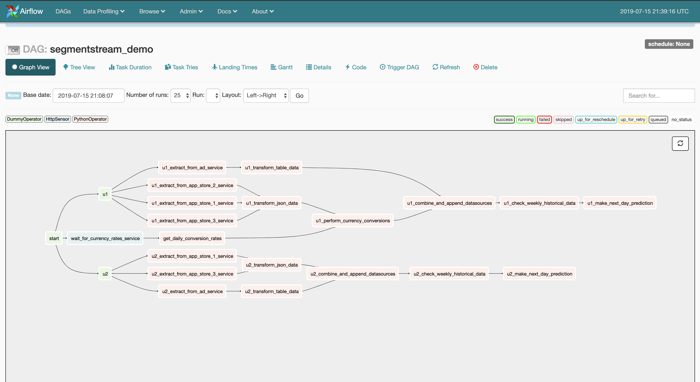
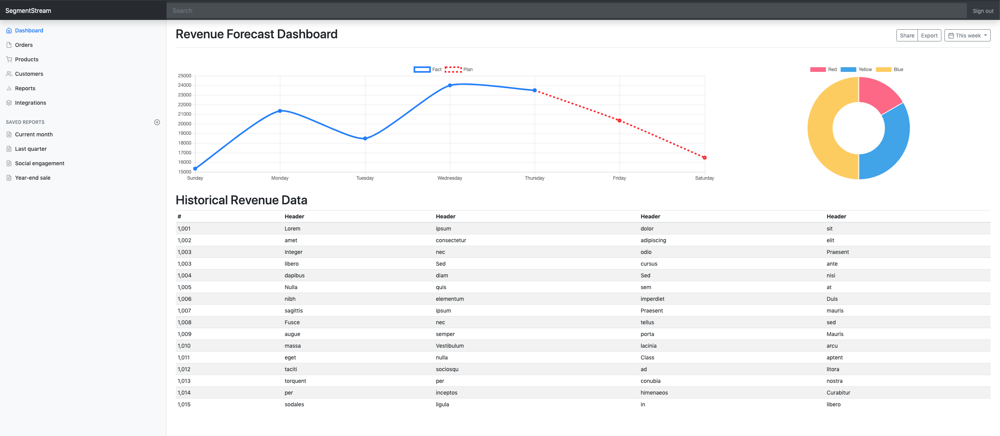
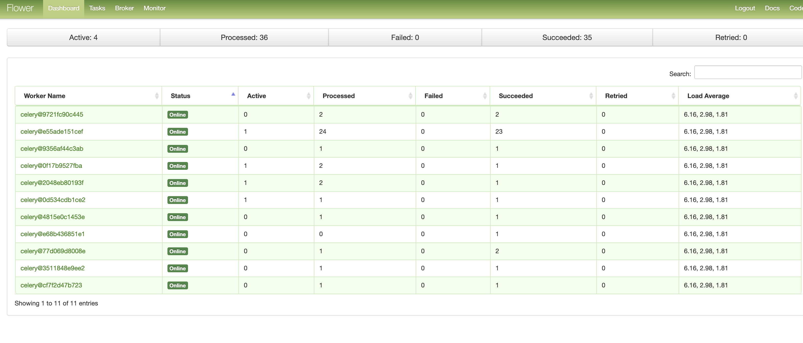
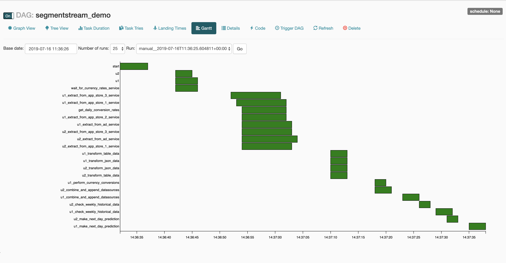
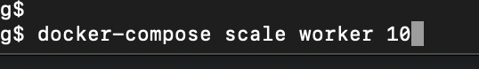
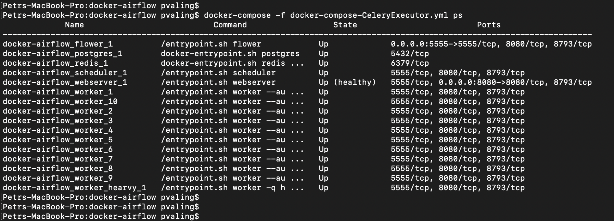

# SegmentStream Workflow Sketch

## Общие сведения о задаче.

Нужно было решить задачу проектирования гибкого workflow движка реализующего ETL процесс.
Процесс, в двух словах, заключается в получении статистики из различных внешних систем, трансформации этой статистики,
слияния данных, обучения модели на новых исторических данных и формирование прогноза на день вперед.

Также важно, чтобы процесс менялся в зависимости от внешних условий. Например, есть
несколько аккаунтов пользователей у которых разные настройки, касающиеся процесса.

В примере это: 
- необходимость делать конвертацию валют
- список подключенных магазинов
- глубина истории для обучения

Система должна масштабироваться и позволять выносить задачи разных типов по разным серверам.

## Структура проекта

/dags - сценарий задачи на фреймворке Apache Airflow

/jupyter - ноутбук с наработками по ML

/services - сервисы-эмуляторы внешних систем

## Общая схема решения

Draw.io Chart
https://drive.google.com/file/d/1WmB1P8F2aTch973tmXorJalT7HWSykBC/view?usp=sharing


## Установка
Airflow из докера
MongoDB из докера
Остальные сервисы на aiohttp запускаются локально

todo...

## Скрины
### Граф процесса

### Мониторинг периодических запусков

### Диаграмма Ганта

### Динамика времени выполнения операций

### Логи исполнения задачи

### Исторические данные в MongoDB

### Данные прогноза в MongoDB

### Визуализация обученной модели

### Проект дашборда



## Масштабирование
Обработчики несложно масштабируются.

Если используется docker-compose с Airflow, то можно просто сделать так:
```bash
docker-compose -f docker-compose-CeleryExecutor.yml scale worker=10
```

Каждый воркер в свою очередь использует несколько подпроцессов (по умолчанию 4).
Можно сделать автоматическое масштабирование количества процессов запуская обработчики 
с ключом 
```
--autoscale=<int max_proc>,<int min_proc> 
например,
--autoscale=10,2
```

## Разделение задач по характеру нагрузки

Можно тяжелые задачи, которые, например, требуют много CPU или GPU выносить на отдельный 
пул обработчиков. Для этого в теле задачи нужно указать параметр 
```bash
queue='<имя_очереди>'
например,
queue='heavy_tasks'

```

```python

make_next_day_prediction = PythonOperator(
    task_id=f"{task_prefix}_make_next_day_prediction",
    python_callable=make_next_day_prediction_callback,
    provide_context=True,
    queue='heavy_tasks',
    dag=dag_x
)

```

Чтобы создать обработчик для особых задач нужно просто запускать команду запуска с 
параметром -q <имя_очереди>

```yaml
worker:
    image: puckel/docker-airflow:1.10.3
    restart: always
    depends_on:
        - scheduler
    volumes:
        - /Users/pvaling/PyCharmProjects/segmentstream_example/dags:/usr/local/airflow/dags
        - /Users/pvaling/PyCharmProjects/segmentstream_example/dags/requirements.txt:/requirements.txt
        # Uncomment to include custom plugins
        # - ./plugins:/usr/local/airflow/plugins
    environment:
        - FERNET_KEY=46BKJoQYlPPOexq0OhDZnIlNepKFf87WFwLbfzqDDho=
        - EXECUTOR=Celery
    command: worker --autoscale=10,2

worker_heavy:
    image: puckel/docker-airflow:1.10.3
    restart: always
    depends_on:
        - scheduler
    volumes:
        - /Users/pvaling/PyCharmProjects/segmentstream_example/dags:/usr/local/airflow/dags
        - /Users/pvaling/PyCharmProjects/segmentstream_example/dags/requirements.txt:/requirements.txt
        # Uncomment to include custom plugins
        # - ./plugins:/usr/local/airflow/plugins
    environment:
        - FERNET_KEY=46BKJoQYlPPOexq0OhDZnIlNepKFf87WFwLbfzqDDho=
        - EXECUTOR=Celery
    command: worker -q heavy_tasks
```

Список воркеров в Flower (UI для Celery)


Конкурентное выполненение


Масштабирование из консоли


Запущеные контейнеры с воркерами после scale=10



