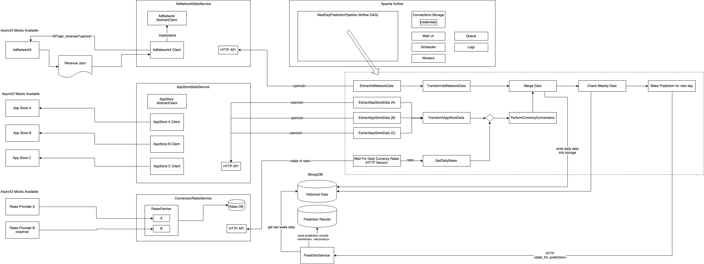
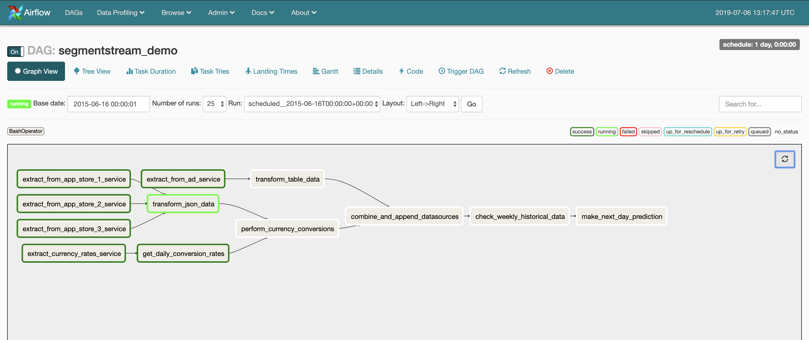
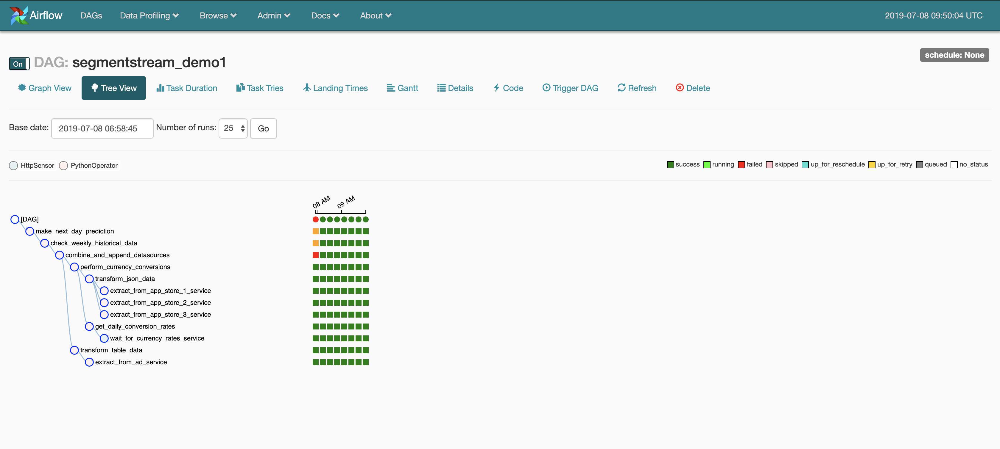
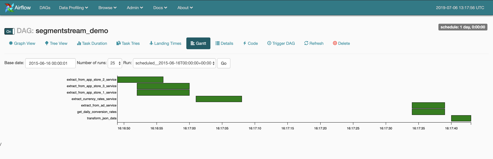
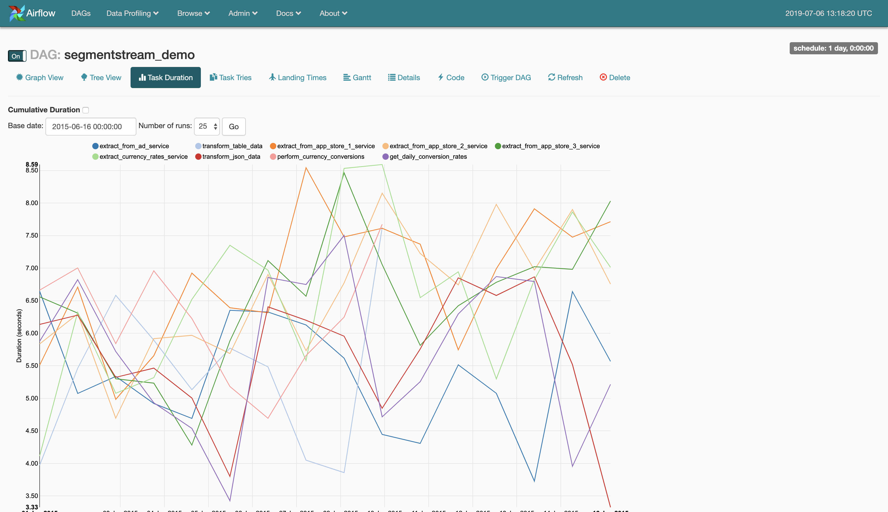
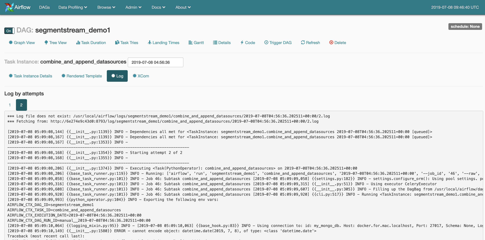
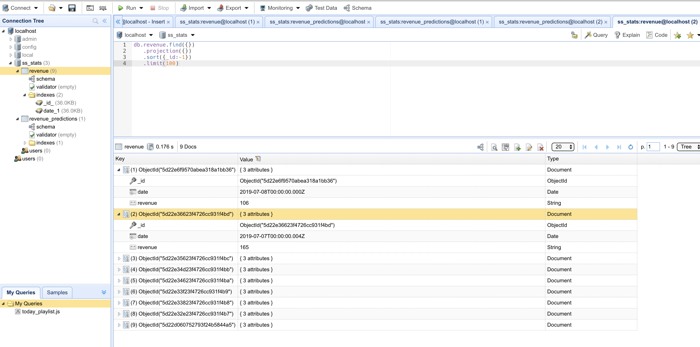
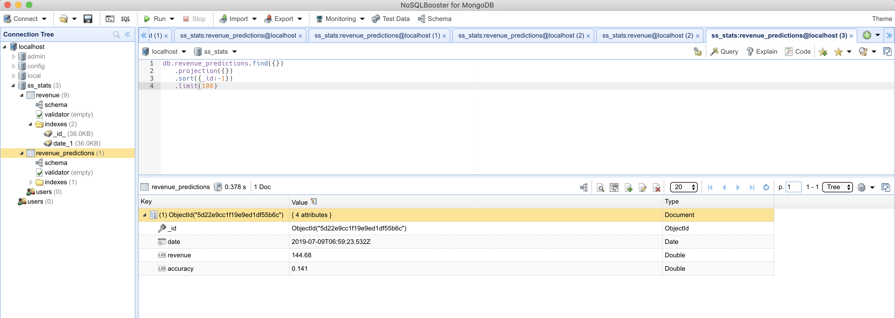
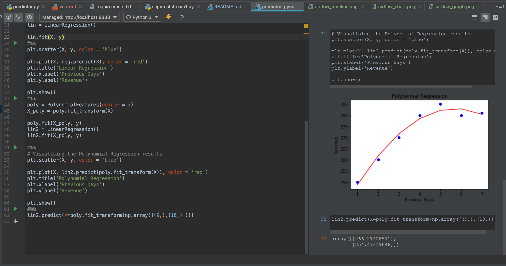

# SegmentStream Workflow Sketch

## Общие сведения о задаче.

Нужно было решить задачу проектирования гибкого workflow движка реализующего ETL процесс.
Процесс, в двух словах, заключается в получении статистики из различных внешних систем, трансформации этой статистики,
слияния данных, обучения модели на новых исторических данных и формирование прогноза на день вперед.

## Структура проекта

/dags - сценарий задачи на фреймворке Apache Airflow

/jupyter - ноутбук с наработками по ML

/services - сервисы-эмуляторы внешних систем

## Общая схема решения

Draw.io Chart
https://drive.google.com/file/d/1WmB1P8F2aTch973tmXorJalT7HWSykBC/view?usp=sharing

## Установка
Airflow из докера
остальное локально запускается
todo...

## Скрины
### Граф процесса

### Мониторинг периодических запусков

### Диаграмма Ганта

### Динамика времени выполнения операций

### Логи исполнения задачи

### Исторические данные в MongoDB

### Данные прогноза в MongoDB

### Визуализация обученной модели

